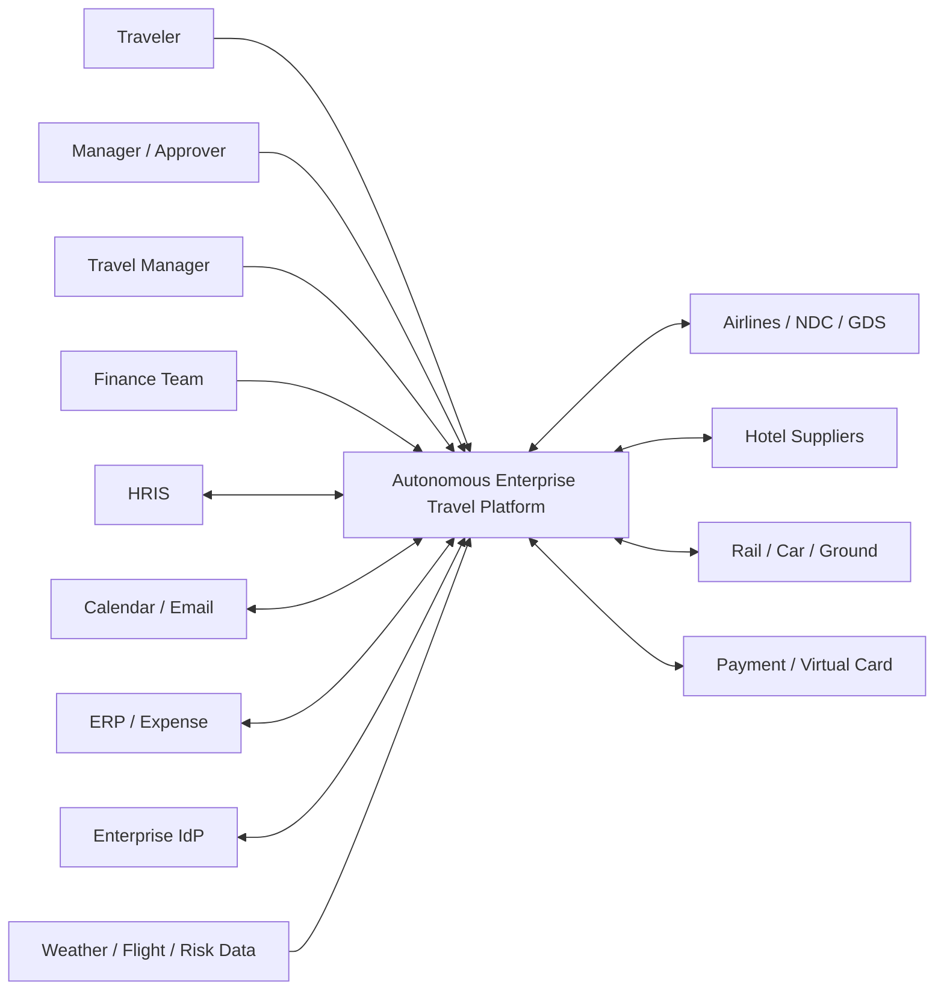
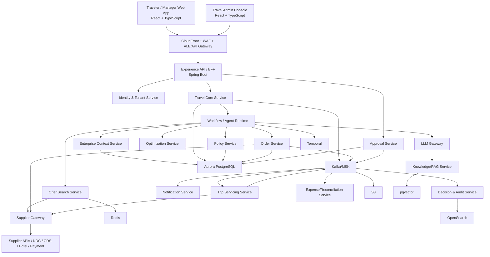
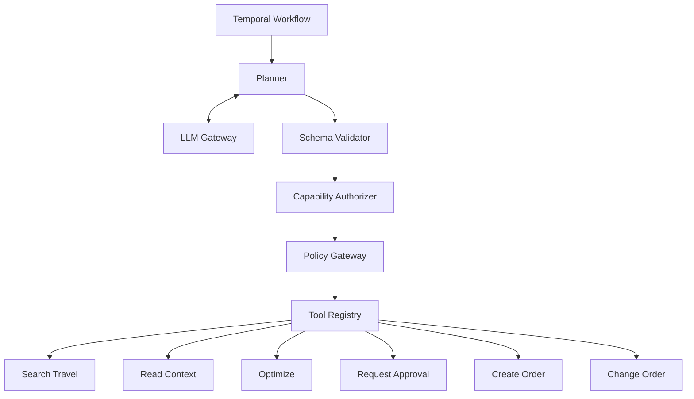
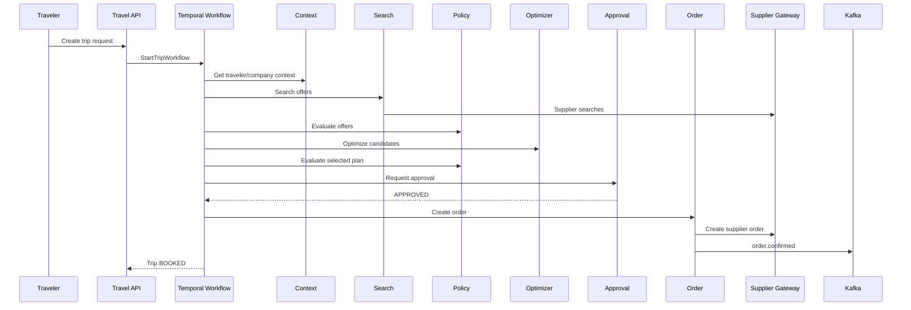

# travel-os — Engineering Design Package (frozen baseline)

> This is the design package frozen before implementation began (2026-09-09). It is the baseline
> that ADRs in `docs/adr/` refine. Where code and this document disagree, an ADR must say why.
>
> Boundary: OmVrti publicly describes an operating system with Enterprise Context, Data
> Intelligence, Optimization, Agentic AI Workflows, Governance, and Learning, and a travel
> application meant to detect demand, plan/optimize trips, enforce dynamic policy, execute bookings,
> service disruptions, automate expense/reconciliation and learn from outcomes. Everything below is
> **our** production architecture for implementing that public vision — not a claim about anyone's
> private implementation.

## 1. Architecture decisions

| Area | Decision |
|---|---|
| Frontend | React + TypeScript |
| Public APIs | REST/JSON |
| Internal synchronous RPC | gRPC |
| Async communication | Kafka |
| Core backend | Java 21 + Spring Boot |
| AI services | Python + FastAPI/Pydantic |
| Workflow engine | Temporal |
| Optimization | Python + OR-Tools |
| Transaction DB | PostgreSQL/Aurora |
| Cache | Redis |
| Event backbone | Kafka/MSK |
| Object storage | S3 |
| Semantic retrieval | pgvector initially |
| Search/audit exploration | OpenSearch |
| Containers | Docker |
| Runtime | Kubernetes/EKS |
| Infrastructure | Terraform |
| Kubernetes packaging | Helm |
| Delivery | GitHub Actions + Argo CD |
| Observability | OpenTelemetry + Prometheus + Grafana |
| Secrets | AWS Secrets Manager |
| Identity | OIDC/SAML + SCIM |
| Authorization | RBAC + ABAC |
| Policy | deterministic policy engine |
| Agent execution | capability/tool based, never unrestricted API access |

The rule enforced across the codebase:

```text
LLM understands and plans.
Optimizer chooses.
Policy engine authorizes.
Workflow engine coordinates.
Transaction services execute.
Kafka tells the rest of the platform what happened.
```

## 2. C4 Level 1 — System context



The platform does six things: understand enterprise context → understand travel need → find
feasible travel → optimize → govern + execute → monitor + continuously improve.

## 3. C4 Level 2 — Containers



## 4. Why Temporal and Kafka both exist

**Temporal** answers "what step of this business process are we in?" (SEARCHING → OPTIMIZING →
AWAITING_APPROVAL → BOOKING → CONFIRMING). If the booking worker dies, the workflow resumes safely.

**Kafka** answers "what happened?" — `order.confirmed` is consumed simultaneously by Notification,
Analytics, Audit, Expense, Duty of Care, Trip Monitoring.

Do not make Kafka your workflow engine. Do not make Temporal your global event bus. (ADR-0002)

## 5. Service ownership

| Service | Owns | Does NOT own |
|---|---|---|
| Identity | tenants, users, roles | travel data |
| Enterprise Context | org structures, traveler profiles, cost centers | bookings |
| Travel Core | trip requests, itinerary lifecycle | supplier APIs |
| Search | search session, normalized offers | final booking |
| Supplier Gateway | external adapters | business policy |
| Policy | policy definitions/evaluations | optimization |
| Optimization | ranking/constraint solving | booking |
| Agent Runtime | planning/tool execution | source-of-truth transactions |
| Approval | approval chains/decisions | booking |
| Order | orders/reservations/payment state | LLM reasoning |
| Servicing | changes/cancellations/disruptions | original intent |
| Audit | immutable decision history | transactional ownership |
| Expense | expense matching/reconciliation | supplier shopping |
| Notification | channels/templates/delivery | business decisions |

Hard rule: **no service directly writes another service's database.** (ADR-0006)

## 6. Core domain model

Tenant, Employee, TravelerProfile, TravelPolicy, TripRequest, Trip, SearchSession, Offer,
OptimizationRun, PolicyDecision, Approval, Order, OrderItem, Payment, TripSegment, Disruption,
AgentDecision, AuditEvent, Expense.

```text
Tenant
 ├── Employees
 ├── Policies
 └── Trips
       ├── TripRequest
       ├── SearchSessions ─ Offers
       ├── OptimizationRuns
       ├── PolicyDecisions
       ├── Approvals
       └── Order ─ Flight / Hotel / Ground
```

## 7–10. Key schemas (baseline; see ADR-0007/0008 for id and money column types)

### trip_request

```sql
CREATE TABLE trip_request (
    id UUID PRIMARY KEY,
    tenant_id UUID NOT NULL,
    traveler_id UUID NOT NULL,
    origin VARCHAR(10),
    destination VARCHAR(10),
    earliest_departure TIMESTAMPTZ,
    arrival_deadline TIMESTAMPTZ,
    return_after TIMESTAMPTZ,
    latest_return TIMESTAMPTZ,
    purpose TEXT,
    status VARCHAR(40) NOT NULL,          -- DRAFT SUBMITTED PLANNING AWAITING_APPROVAL APPROVED BOOKING BOOKED CANCELLED FAILED
    source VARCHAR(30) NOT NULL,
    created_at TIMESTAMPTZ NOT NULL,
    updated_at TIMESTAMPTZ NOT NULL,
    version BIGINT NOT NULL DEFAULT 0
);
```

### traveler_profile

```sql
CREATE TABLE traveler_profile (
    traveler_id UUID PRIMARY KEY,
    tenant_id UUID NOT NULL,
    employee_number VARCHAR(100),
    home_airport VARCHAR(10),
    preferred_airlines JSONB,
    preferred_hotels JSONB,
    seat_preferences JSONB,
    loyalty_programs JSONB,
    accessibility_requirements JSONB,
    travel_class VARCHAR(30),
    created_at TIMESTAMPTZ NOT NULL,
    updated_at TIMESTAMPTZ NOT NULL
);
```

Do **not** put passport/identity data here. A separate encrypted vault domain is created if visa or
passport information is ever needed.

### travel_offer

```sql
CREATE TABLE travel_offer (
    id UUID PRIMARY KEY,
    search_session_id UUID NOT NULL,
    provider VARCHAR(100) NOT NULL,
    provider_offer_id VARCHAR(255),
    offer_type VARCHAR(30),
    total_amount DECIMAL(12,2),
    currency CHAR(3),
    refundable BOOLEAN,
    change_penalty DECIMAL(12,2),
    expires_at TIMESTAMPTZ,
    normalized_payload JSONB NOT NULL,
    created_at TIMESTAMPTZ NOT NULL
);
```

Search result ≠ booking. Offer ≠ Order. (ADR-0004)

### travel_order

```sql
CREATE TABLE travel_order (
    id UUID PRIMARY KEY,
    tenant_id UUID NOT NULL,
    trip_id UUID NOT NULL,
    supplier VARCHAR(100),
    external_order_id VARCHAR(255),
    status VARCHAR(50) NOT NULL,          -- CREATING HELD PAYMENT_PENDING CONFIRMING CONFIRMED CHANGE_PENDING CHANGED CANCELLATION_PENDING CANCELLED FAILED PARTIALLY_FAILED
    total_amount DECIMAL(12,2),
    currency CHAR(3),
    idempotency_key VARCHAR(255) UNIQUE NOT NULL,
    created_at TIMESTAMPTZ NOT NULL,
    updated_at TIMESTAMPTZ NOT NULL,
    version BIGINT NOT NULL DEFAULT 0
);
```

## 11. Policy model

Policy is structured, versioned rules — never `if` statements scattered through Java.

```json
{
  "policyId": "US_STANDARD_TRAVEL",
  "version": 12,
  "flight": {
    "domesticCabin": ["ECONOMY"],
    "internationalCabin": ["ECONOMY", "PREMIUM_ECONOMY"],
    "maxAmountAboveLogicalLowest": 150
  },
  "hotel": { "defaultNightlyLimit": 240 },
  "approval": { "managerRequiredAbove": 1200 },
  "autonomy": {
    "flightRebooking": { "enabled": true, "maximumIncrementalCost": 100 }
  }
}
```

Every evaluation produces immutable evidence:

```json
{
  "decisionId": "pd_8123",
  "policyVersion": 12,
  "result": "ALLOW",
  "rulesEvaluated": ["DOMESTIC_ECONOMY_ONLY", "REBOOK_DELTA_LIMIT"],
  "reasonCodes": [],
  "requiresApproval": false
}
```

Never return simply `true`. You need explainability.

## 12. Optimization model

Input: candidate offers + constraints. Hard constraints (arrival < required arrival, cabin allowed,
supplier permitted, hotel within radius, traveler eligible, budget feasible) make a candidate
infeasible. Soft objectives:

```
Score(x) = w1·C + w2·T + w3·R + w4·P + w5·X
C = normalized cost, T = employee time impact, R = disruption risk,
P = preference penalty, X = experience/productivity penalty
```

The API returns the entire ranking with a per-candidate breakdown, not only the winner.

```json
{
  "optimizationRunId": "opt_2901",
  "selected": "bundle_392",
  "candidates": [
    { "bundleId": "bundle_392", "score": 91.4, "cost": 820,
      "explanation": { "costScore": 88, "scheduleScore": 98, "riskScore": 90 } }
  ]
}
```

## 13–15. Events

Standard envelope (see `contracts/events/event-envelope.schema.json`):

```json
{
  "eventId": "01JXYZ...",
  "eventType": "travel.order.confirmed",
  "eventVersion": 1,
  "occurredAt": "2026-09-09T20:11:52Z",
  "tenantId": "tenant_23",
  "correlationId": "trip_9382",
  "causationId": "command_882",
  "producer": "order-service",
  "data": {}
}
```

Initial topics: `travel.intent`, `travel.trip`, `travel.search`, `travel.policy`,
`travel.optimization`, `travel.approval`, `travel.order`, `travel.disruption`, `travel.expense`,
`travel.agent`, `travel.audit`. One topic per bounded context, not per tiny event.

Example — consumed by the Servicing service, never by the LLM directly:

```json
{
  "eventType": "travel.disruption.detected",
  "eventVersion": 1,
  "tenantId": "acme",
  "correlationId": "trip_2731",
  "data": {
    "orderId": "ord_3391", "segmentId": "seg_2", "type": "FLIGHT_CANCELLED",
    "supplier": "DL", "flightNumber": "DL291", "scheduledDeparture": "2026-10-11T20:10:00Z"
  }
}
```

## 16–19. Public REST API (`/api/v1`)

- `POST /api/v1/trips` `{ travelerId, request: "I need to be in Seattle before 9am Tuesday..." }`
  → `202 Accepted` `{ tripId, status: "PLANNING" }`. Planning does not finish inside the request.
- `GET /api/v1/trips/{tripId}` → `{ status, intent, recommendedPlan, policy: {compliant}, approval: {required} }`
- `POST /api/v1/approvals/{approvalId}/decisions` `{ decision: "APPROVE", comment }` with
  `Idempotency-Key` header.
- `GET /api/v1/trips/{tripId}/decisions` — **first-class explainability**: why this itinerary, why
  approval was required, why the system rebooked, why the trip exceeded budget. Not buried in chat.

## 20–22. Internal gRPC contracts

See `contracts/protobuf/`: `OptimizationService.OptimizeTrip`, `PolicyService.EvaluateTrip` /
`EvaluateAction` (booking an itinerary ≠ letting an agent rebook for +$83), `SupplierGateway`
(`SearchAir`, `PriceOffer`, `CreateOrder`, `ChangeOrder`, `CancelOrder`) with adapters
(Sandbox, NDC, GDS, Hotel, Ground) behind it. Services never know vendor payload shapes.

## 23–24. Agent runtime



Execution: LLM proposal → JSON schema → capability authorization → business validation → policy →
tool → transaction service. The LLM can say `{"tool":"change_order", ...}`; it cannot invoke supplier
APIs. Agents are machine identities (`agent/disruption-recovery/v1`) with permissions like
`trip:read:self`, `offer:search:self`, `order:change:self`, `policy:evaluate` — never `*`.

## 25–27. Booking sequence, saga, idempotency



Saga: hold flight → hold hotel → authorize payment → create supplier order → confirm air → confirm
hotel → finalize payment. If hotel confirmation fails: cancel flight, release hotel hold, void
payment, mark saga failed, escalate. A distributed travel transaction cannot rely on SQL rollback.

Idempotency: every command (`CreateOrder`, `ChangeOrder`, `CancelOrder`, `ApproveTrip`, `IssueRefund`)
takes a key like `TRIP-81:CREATE-ORDER:1`; 20 retries → 1 airline order. (ADR-0005)

## 28–30. Disruption recovery and the decision ledger

```text
DETECTED → IMPACT_CONFIRMED → SEARCHING_ALTERNATIVES → OPTIMIZING → DECISION_READY
    ├── HUMAN_REQUIRED → WAITING_APPROVAL
    └── AUTO_ALLOWED → CHANGING → RESOLVED
```

Every transition is persisted. Every autonomous decision is a ledger entry:

```json
{
  "decisionId": "decision_928", "tenantId": "acme", "tripId": "trip_81",
  "decisionType": "DISRUPTION_REBOOK", "trigger": { "type": "FLIGHT_CANCELLED" },
  "candidatesEvaluated": 14, "selectedCandidate": "offer_829",
  "policy": { "decision": "ALLOW", "policyVersion": 17 },
  "optimization": { "runId": "opt_21", "score": 94.2 },
  "agent": { "name": "disruption-recovery", "version": "1.3" },
  "execution": { "autonomous": true, "incrementalCost": 73 }
}
```

"Why did we spend an extra $73 on September 8?" is answered with evidence.

## 31–34. AWS / EKS topology

CloudFront → WAF → ALB → EKS across three AZs; Aurora PostgreSQL Multi-AZ; ElastiCache Redis;
MSK; OpenSearch; S3; KMS; Secrets Manager; controlled egress (NAT/proxy) to suppliers and model
providers. Namespaces: `travel-prod-edge`, `-core`, `-ai`, `-workflows`, `-observability`.
Every service: Deployment, Service, HPA, PDB, NetworkPolicy, ServiceAccount (IRSA), ServiceMonitor.
Critical services `minReplicas: 3` across AZs. Node pools: `general-services`, `workflow-workers`,
`ai-workers`. No GPUs initially — inference goes through external model APIs; our AI workload is
orchestration, retrieval, structured reasoning, evaluation and optimization.

## 35–39. Security

- Three principal kinds — human, service, agent — each with identity and scopes.
- Multi-tenancy in depth: JWT tenant claim → service authorization → Postgres RLS where practical →
  tenant-scoped cache keys → tenant-scoped Kafka metadata → tenant-aware observability.
  Never let `GET /trips?id=...` grant access by knowing a UUID.
- TLS 1.2+, mTLS internally where appropriate, KMS-managed encryption at rest everywhere.
- The model is not a security boundary: prompt injection cannot override `PolicyService → DENY`;
  hallucinated parameters fail schema validation before execution.
- One LLM gateway: routing, structured outputs, fallbacks, timeouts, token/cost budgets, prompt
  registry, PII processing, logging, evaluations, caching, tenant controls.

## 40–43. Observability and SLOs

Every request carries `trace_id`, `correlation_id`, `tenant_id`, `trip_id`, `workflow_id`; one
trace shows the entire lifecycle. Business metrics: search/booking success rate, supplier error
rate, median planning time, policy compliance rate, human approval rate, autonomous execution rate,
human override rate, rebooking success, disruption resolution time, savings vs baseline, cost and
LLM cost per trip. AI metrics: invalid tool-call rate, schema failures, agent loop count, reasoning
latency, tool failure rate, decision acceptance, retrieval relevance, fallback rate.

| Operation | Initial target |
|---|---|
| Get trip | 99.9% |
| Policy evaluation | p95 < 150 ms |
| Search orchestration | 99.9% |
| Transaction API | 99.95% |
| Audit durability | effectively no intentional loss |
| Booking command | at-least-once handling + idempotent execution |
| Workflow recovery | automatic |

## 44. Repository structure

Monorepo with independently deployable services: `apps/`, `services/`, `intelligence/`,
`workflows/`, `contracts/`, `platform/`, `infrastructure/`, `tests/`, `docs/`. (ADR-0001)

## 45–51. Slice 1 — the first production vertical slice

> Employee explicitly requests a domestic business trip. System understands requirements, retrieves
> enterprise context, searches real supplier/sandbox inventory, filters by deterministic corporate
> policy, optimizes compliant choices, obtains human approval when needed, creates an order through a
> provider adapter, and stores a fully auditable decision trail.

```
LOGIN → CREATE TRIP → UNDERSTAND REQUEST → LOAD EMPLOYEE CONTEXT → SEARCH → NORMALIZE OFFERS
→ POLICY FILTER → OPTIMIZE → PRESENT PLAN → APPROVE → CREATE ORDER → CONFIRM → AUDIT
```

Deploy only: gateway, enterprise-context, travel-core, supplier-gateway, policy, optimization,
order, agent-runtime, audit + Temporal, Postgres, Redis, Kafka. Postpone: expense, rewards,
predictive travel, learning, multi-channel comms, duty of care, complex payment, multi-GDS.

Supplier support: one `AirSupplier` interface (`search`, `price`, `createOrder`, `cancelOrder`) with a
`SandboxSupplierAdapter`; NDC/GDS adapters later with zero business-logic change.

Scope: US domestic, round trip, single traveler, economy, one origin, one destination, one airline
itinerary, one hotel, USD. Controlled production scope, not prototype quality.

LLM responsibilities in Slice 1: intent extraction, missing-information reasoning, explanation,
workflow planning under bounded tool schemas. It does **not** decide cabin permission, budget,
payment, or autonomy.

Definition of done: real authentication · tenant isolation · Postgres persistence · versioned APIs ·
provider abstraction · deterministic policy · optimization engine · durable workflow · booking
idempotency · retry-safe supplier calls · Kafka events · audit trail · distributed tracing · metrics ·
integration tests · contract tests · E2E happy path · failure-path tests · Docker images · Terraform ·
EKS deployment · CI · CD · rollback.

## 52–55. Later slices

- **Slice 2** — autonomous disruption recovery (flight cancelled → find impacted trip → search →
  policy → optimize → determine autonomy → auto-change or escalate → audit → notify).
- **Slice 3** — hotel, ground, multi-city, international, complex policies, multiple suppliers,
  preferred supplier agreements.
- **Slice 4** — enterprise automation: calendar, CRM, email, HRIS, expense; detect travel demand
  before an employee creates a trip.
- **Slice 5** — learning from outcomes (suggested vs selected, overrides, reasons, disruptions,
  cost, satisfaction, exceptions). No personalization models before real outcome data exists.

## Scale and resilience commitments (from the follow-up review)

- Stateless services; state in Postgres, Redis, Temporal, Kafka only. HPA on CPU, concurrency,
  Kafka lag, Temporal queue depth. Pods spread across nodes and three AZs (anti-affinity, topology
  spread, PDBs).
- Supplier Gateway: per-adapter rate limiter, queue, connection pool, circuit breaker, bounded
  retries with exponential backoff and jitter. Suppliers, not our infrastructure, are the likely
  bottleneck.
- Kafka provides backpressure for search; bookings are never queued casually — they are idempotent.
- Database: connection pooling, read replicas, no N+1, pagination; connection exhaustion kills
  Postgres long before CPU does.
- Redis is a cache and rate-limit store, never the record of a booking.
- LLM outage → degraded natural-language planning, never unsafe transactions. Model fallbacks via
  the gateway.
- Security: WAF + Shield at the edge; strict rate limits (a cheap HTTP request must never become
  a $1 LLM/supplier call); OIDC/SAML + MFA + SCIM; short-lived signed tokens; authorization on
  every object (no IDOR); tenant isolation in depth; parameterized SQL; prompt injection contained
  by the proposal pipeline; agents never hold admin credentials; IRSA per service; Secrets Manager
  + KMS; private subnets, NetworkPolicies, egress allow-lists; tokenized payments; immutable audit;
  supply-chain controls (SAST, dependency/container scans, SBOM, signed images); tested backups,
  rotation and rollback; security monitoring and playbooks.
- Acceptance: 1,000 concurrent sessions under representative load; survives pod loss, AZ loss,
  supplier and LLM failure, duplicate requests (exactly one logical booking), and adversarial tests
  (cross-tenant access impossible, unauthorized order change rejected, prompt-injection policy bypass
  rejected, no direct DB exposure, no secrets in source). Chaos-tested while under load.
