# UI tour — travel-os web app

Every screen of the web app, captured from the running local stack (sandbox suppliers) by `ui-tour/capture.js` on 2026-09-23 (commit after `b4e2fe1`). One section per screen: what it shows, who sees it, what each control does. Re-take the screenshots with:

```
make images && make stack-up
cd web && NODE_PATH=$PWD/node_modules node ../docs/frontend/ui-tour/capture.js
python3 docs/frontend/ui-tour/build.py
```

## Chapters

1. [Signing in](#1-signing-in)
2. [Your trips](#2-your-trips)
3. [Asking for a trip](#3-asking-for-a-trip)
4. [Watching it get booked](#4-watching-it-get-booked)
5. [When policy needs a person](#5-when-policy-needs-a-person)
6. [Cancelling](#6-cancelling)
7. [When the airline cancels](#7-when-the-airline-cancels)
8. [Demand detected from the calendar](#8-demand-detected-from-the-calendar)
9. [Learning and money](#9-learning-and-money)
10. [Edges](#10-edges)

## 1. Signing in

Every screen sits behind the company identity provider; the sandbox chip is on every page.

### 1.1 The front door

*Who sees it:* anyone


Before anything else the app shows one button. There is no local password form: the button starts the OIDC (PKCE) sign-in with Keycloak, which stands in for the company's identity provider.

| Control | What it does |
|---|---|
| Sign in | starts the redirect to the identity provider; nothing else is reachable without it |

### 1.2 The identity provider's login

*Who sees it:* anyone

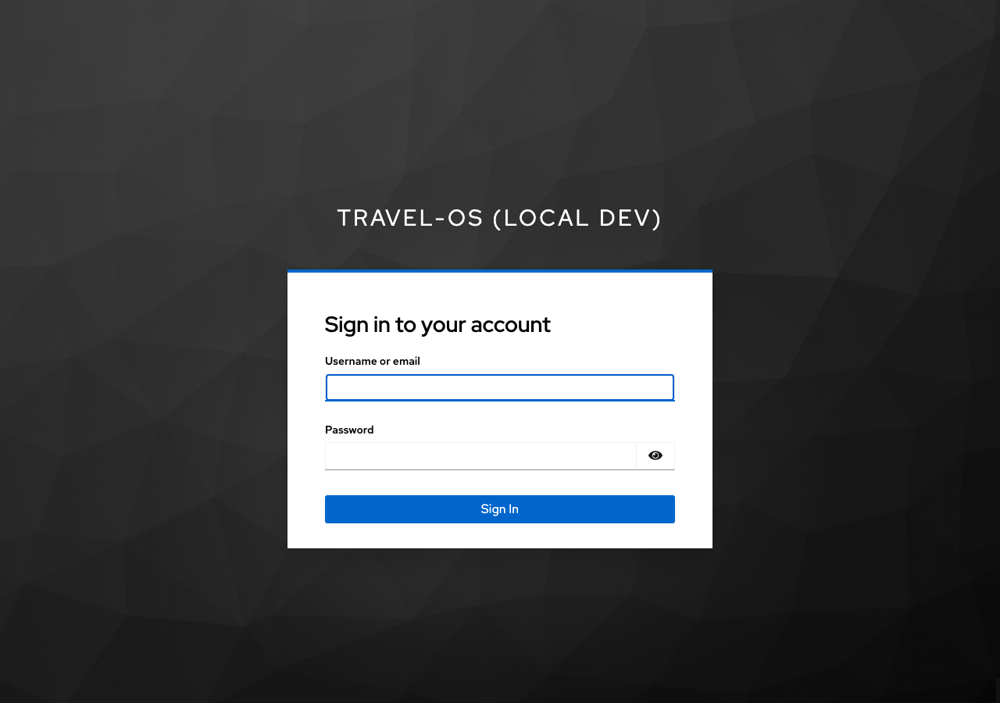

Credentials are typed on the identity provider's own page, never in the app. The sandbox realm seeds five users: alice (traveler), bob (manager), carol (travel admin + Finance), dan (traveler), zoe (another tenant).

| Control | What it does |
|---|---|
| Username / Password | the realm's seeded dev users |
| Sign in | returns to the app with an authorization code; tokens stay in memory (no cookies, no local storage) |

### 1.3 Overview

*Who sees it:* every signed-in user

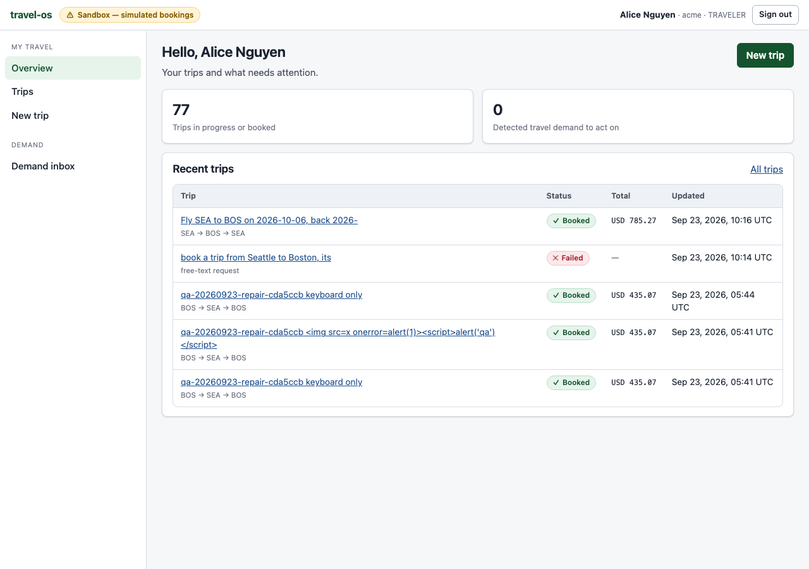

The landing page after sign-in: who you are (name, tenant, roles in the banner), how many trips are in progress or booked, whether detected travel demand is waiting for you, and your most recent trips with their live status and exact totals.

| Control | What it does |
|---|---|
| Sandbox — simulated bookings | the chip says which environment this is; it never leaves the header |
| New trip | the primary action, always one click away |
| Recent trips | each row links to the trip; totals show the currency explicitly |
| Navigation | shows only the areas your roles allow: a traveler sees My travel and Demand; managers add Approvals; travel admins and Finance add Disruptions, Finance, Connectors and Learning |

### 1.4 Signed out

*Who sees it:* anyone

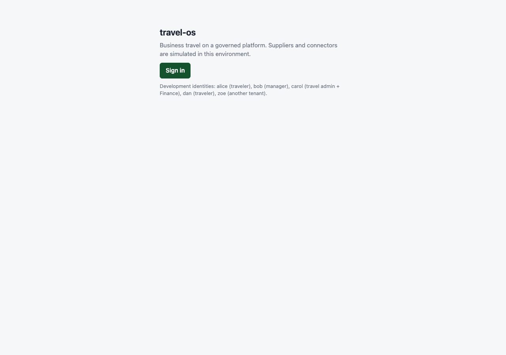

Sign out ends the session at the identity provider too and returns to the front door; cached data belongs to the account that loaded it and is cleared when the account changes.

| Control | What it does |
|---|---|
| Sign in | a different user can sign in without seeing the previous user's data |

## 2. Your trips

Everything you asked for, newest first, with the truth about where each one stands.

### 2.1 Trips

*Who sees it:* traveler (own trips); managers, travel admins and Finance see the tenant's trips in their inboxes

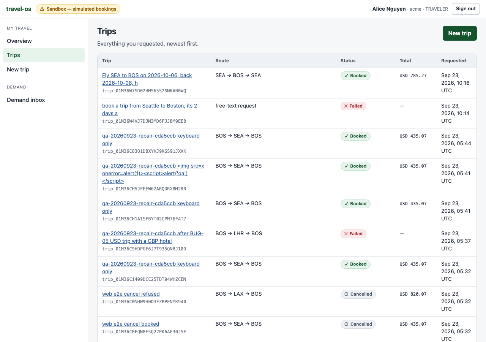

One row per request: the purpose you typed, the route, the status badge (Submitted, Planning, Awaiting approval, Approved, Booking, Booked, Cancelling, Cancelled, Failed, Completed), the total when there is one, and when it last changed. Other people's trips are simply not here — the server answers 404 for anything you may not see.

| Control | What it does |
|---|---|
| Row link | opens the trip |
| Status badge | the platform's own state, never inferred by the browser |
| Total | exact minor units with the currency; a dash means nothing was booked |

### 2.2 Trips on a phone

*Who sees it:* everyone

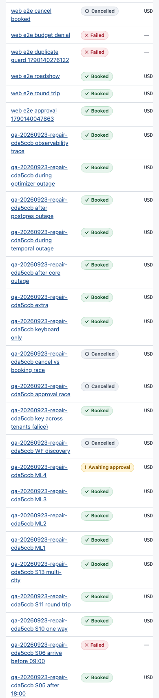

The same list at 390 px: the navigation folds, rows stack, nothing scrolls sideways.

| Control | What it does |
|---|---|
| Navigation | opens from the header at phone width |

## 3. Asking for a trip

Tell the platform what you need; submitting books it.

### 3.1 New trip

*Who sees it:* traveler; managers and travel admins may arrange for others

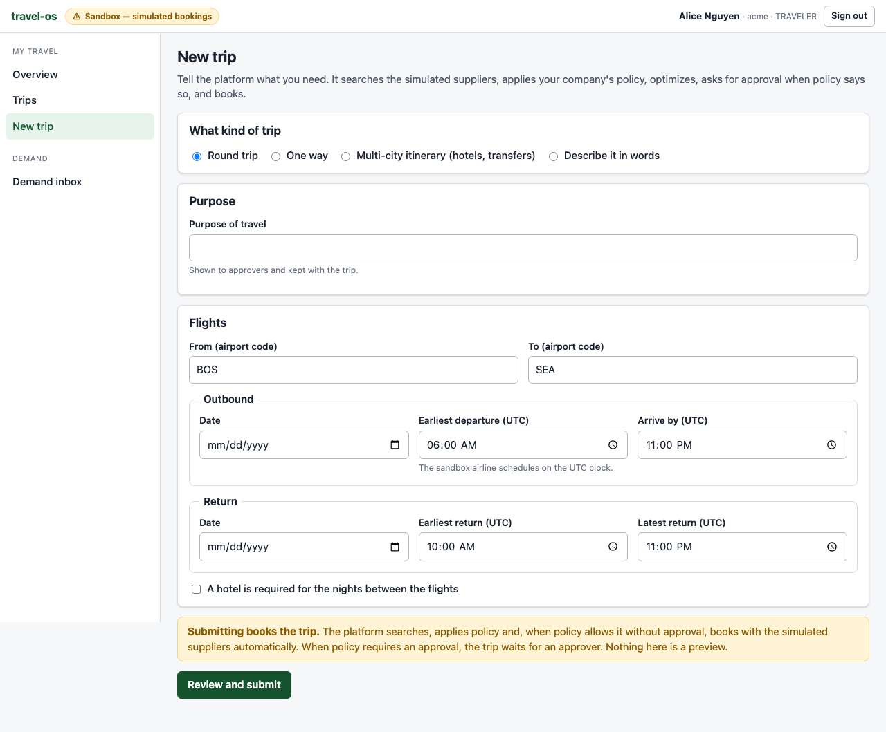

Four ways to ask: a round trip, a one-way, a multi-city itinerary with hotels and transfers, or a description in words. The page says what submitting means before you type anything.

| Control | What it does |
|---|---|
| What kind of trip | switches the form; nothing is lost when you switch back |
| Purpose of travel | shown to approvers and kept with the trip |
| Submitting books the trip | the honest warning: this is not a preview; the platform searches, applies policy, and books with the simulated suppliers, waiting for an approver only when policy says so |

### 3.2 A round trip, filled in

*Who sees it:* traveler

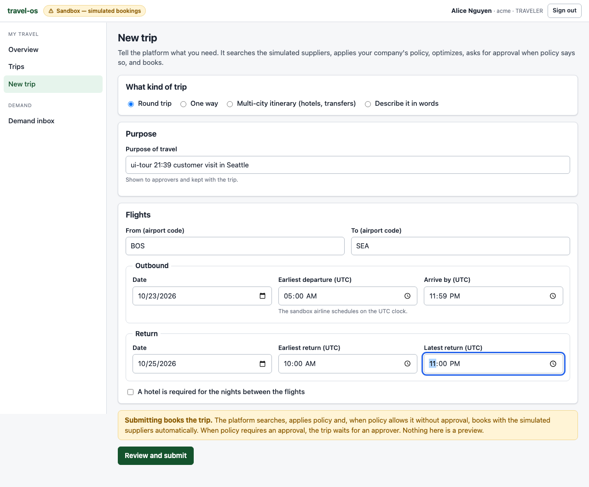

Airports are three-letter codes from the platform's catalog (about a hundred airports; a city code such as NYC is refused with the airports it stands for). Windows are given as a date plus earliest/latest times on the UTC clock the sandbox airline schedules on.

| Control | What it does |
|---|---|
| From / To | airport codes; validated against the catalog when you submit |
| Outbound / Return | date and time window; the return must not be before the outbound |
| A hotel is required | asks for a stay on the nights between the flights |
| Review and submit | validates in the browser first, then shows the review step |

### 3.3 Review before it books

*Who sees it:* traveler

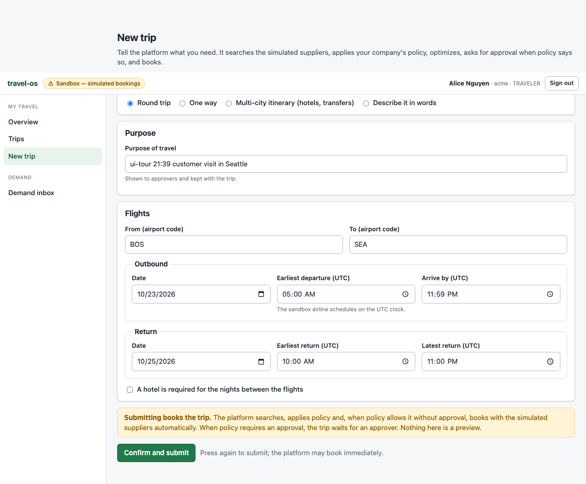

The review step repeats exactly what will be sent and repeats that confirming books. A double click or a lost answer cannot create two trips: the request carries a fixed idempotency key.

| Control | What it does |
|---|---|
| Confirm and submit | creates the trip and opens it; the button disables while the answer is pending |
| Back | returns to the form with everything kept |

### 3.4 Describe it in words

*Who sees it:* traveler

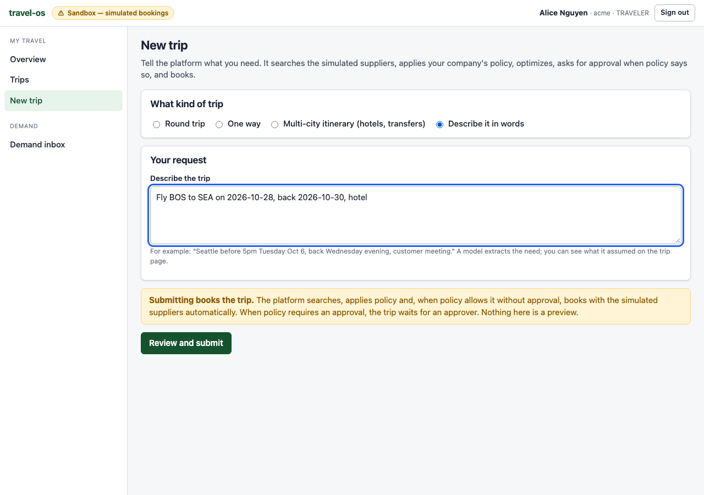

Free text is understood into a structured intent. In the sandbox the understanding is a deterministic offline extractor: it needs airport codes and YYYY-MM-DD dates ("Fly BOS to SEA on 2026-10-06, back 2026-10-08, hotel"). With a model key configured, the real model does this instead. What was concluded is always shown on the trip page, as data.

| Control | What it does |
|---|---|
| Describe the trip | one message, one intent; there is no back-and-forth conversation (stated in the README's pilot scope) |

### 3.5 A multi-city itinerary

*Who sees it:* traveler

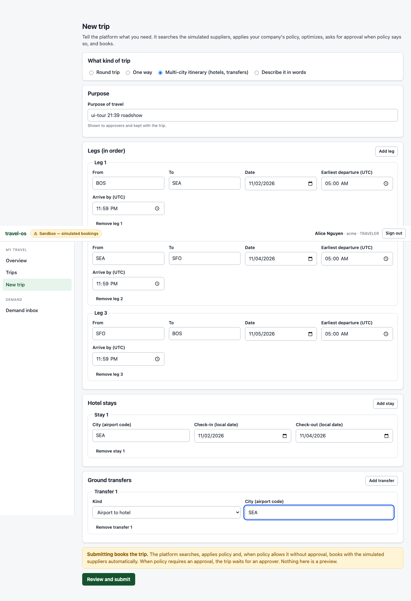

Ordered legs that must chain (each departs where the previous landed), stays in a city a leg lands in on the property's local dates, and airport transfers hanging off a leg. Every component gets a stable id and is reported on the trip page as it is planned, quoted and booked.

| Control | What it does |
|---|---|
| Add leg / Add stay / Add transfer | up to eight legs; stays need check-in/check-out local dates; a transfer names its city and kind |
| Remove … | each component can be dropped before submitting |

### 3.6 Arranging for someone else

*Who sees it:* manager, travel admin

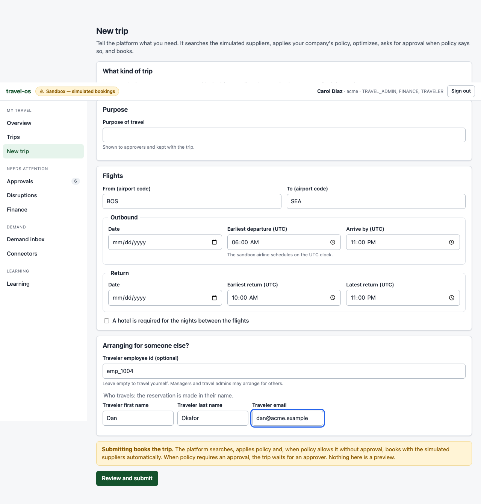

A manager or travel admin may request a trip for another employee. Because the reservation is made in the traveler's name, the form asks for that person's name and email; the platform refuses an anonymous arranged trip.

| Control | What it does |
|---|---|
| Traveler employee id | who travels; leave empty to travel yourself |
| Traveler first name / last name / email | required as soon as an employee id is given; stored with the trip and used for the booking |

### 3.7 Validation before anything leaves the browser

*Who sees it:* traveler

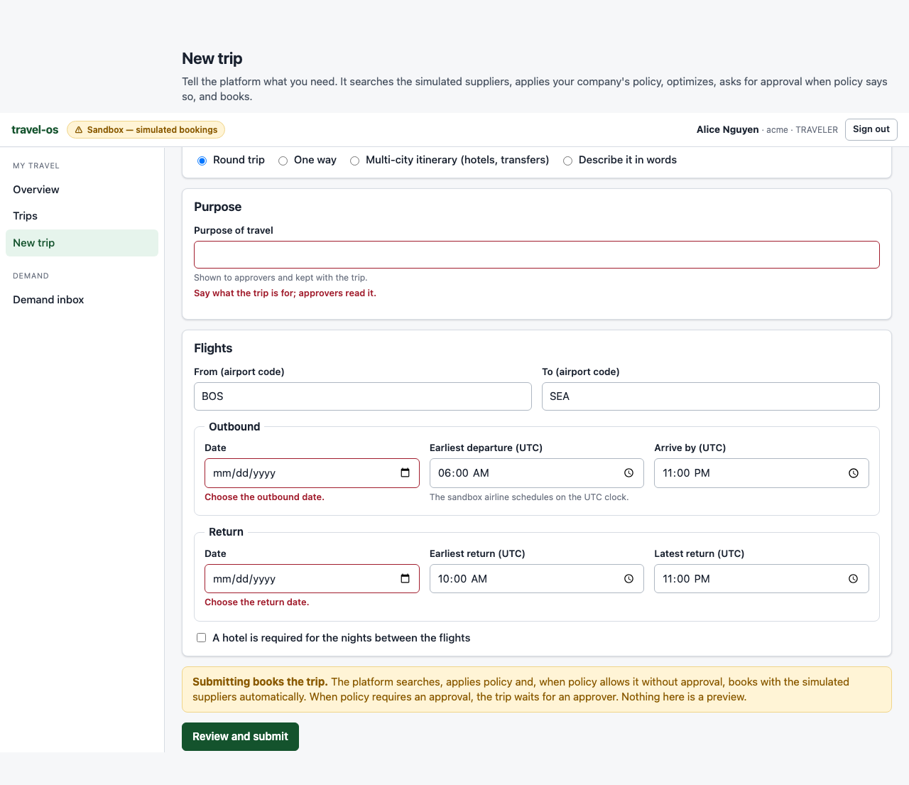

Missing or inconsistent fields are marked on the field itself and announced to assistive technology; nothing is sent until they are fixed.

| Control | What it does |
|---|---|
| Field errors | associated with their inputs (aria-describedby) and read by screen readers |

### 3.8 The server refuses what the browser cannot know

*Who sees it:* traveler

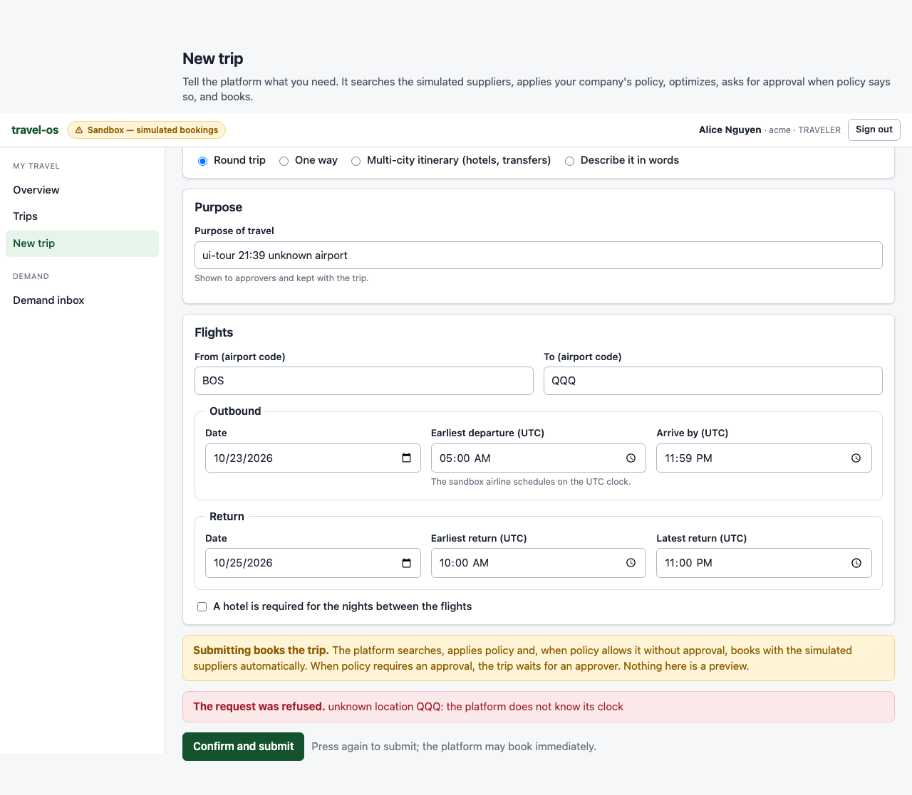

Some rules live only on the server: an airport outside the catalog, a departure window that has already closed, a currency the suppliers do not quote. The refusal comes back as a problem document with a stable code and a sentence you can act on, shown in place; the form keeps your input.

| Control | What it does |
|---|---|
| The request was refused | the server's code and detail (here UNKNOWN_LOCATION); nothing was created |

## 4. Watching it get booked

The trip page tells you where it is, what was chosen and why.

### 4.1 Just submitted

*Who sees it:* traveler

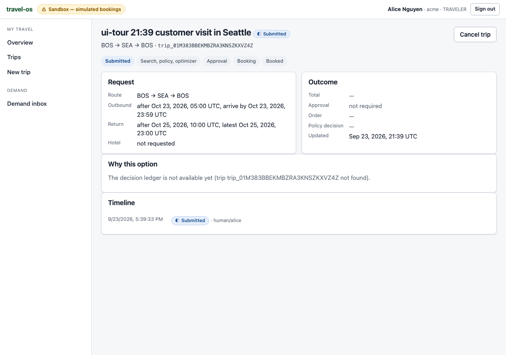

Seconds after confirming: the progress strip shows Submitted done and Search, policy, optimizer current. The page polls with backoff until the platform reaches a resting state.

| Control | What it does |
|---|---|
| Progress strip | Submitted → Search, policy, optimizer → Approval → Booking → Booked; each step is done, current, pending, skipped (not needed) or failed |
| Cancel trip | available while nothing is booked yet; stops the planning |

### 4.2 Booked

*Who sees it:* traveler

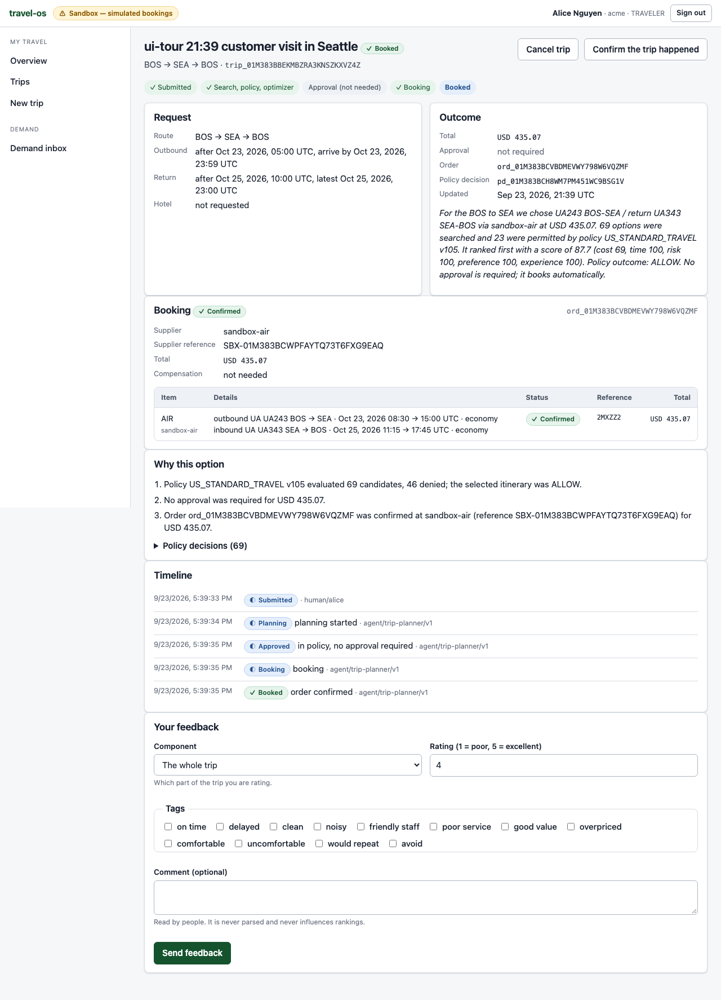

The whole story on one page: the request as frozen, the outcome (total, whether approval was needed, the order and policy-decision ids), the narration of the choice, the booking with its supplier reference, record locator and each segment, Why this option (policy verdicts, the optimizer's ranking, the order confirmation), the timeline of every status change with who or what caused it, and a feedback form once the trip exists.

| Control | What it does |
|---|---|
| Cancel trip | releases the reservation at the suppliers first (see the cancellation chapter) |
| Confirm the trip happened | completion is attested by a person after the last arrival, never inferred from a timer |
| Policy decisions (n) | expands every candidate policy judged, with reason codes |
| What the model concluded | for free-text trips: the extraction, its confidence and assumptions |
| Your feedback | rating, tags and a comment read by people; it never influences rankings |

### 4.3 A multi-city trip, booked

*Who sees it:* traveler

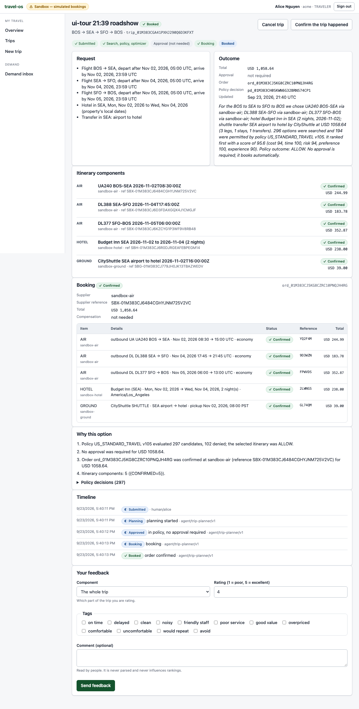

Each leg, stay and transfer is a component with its own status, supplier reference and price; the booking lists the flights in UTC and the hotel and transfer on their local clocks.

| Control | What it does |
|---|---|
| Itinerary components | one line per component with its supplier and reference |
| Booking table | every item of the order, its status, reference and exact total |

### 4.4 The trip page on a phone

*Who sees it:* traveler

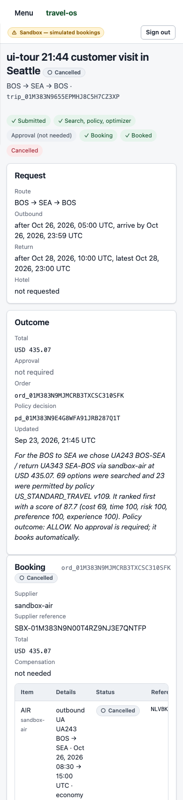

The same content stacked in one column; buttons stay reachable at 390 px.

## 5. When policy needs a person

Policy decides deterministically; a person decides when policy says so.

### 5.1 Awaiting approval, seen by the traveler

*Who sees it:* traveler

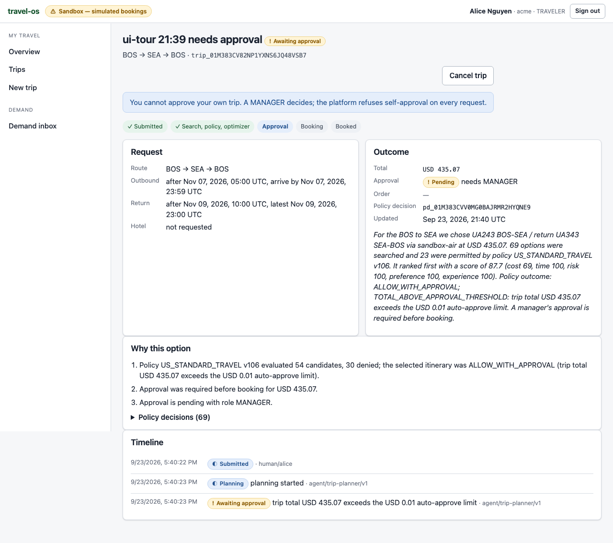

The platform found an option, policy said it needs a manager, and the trip waits. The traveler sees the plan and the reason, and cannot approve their own trip — the server refuses self-approval even if the button were forged.

| Control | What it does |
|---|---|
| You cannot approve your own trip | who decides is stated; the traveler can still cancel |

### 5.2 Approvals inbox

*Who sees it:* manager, travel admin

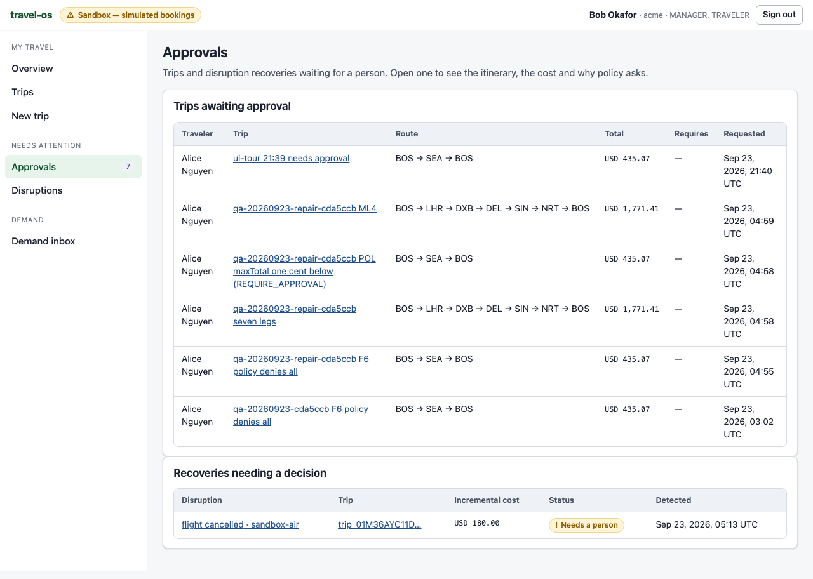

Every trip of the tenant that is waiting for a decision, and every disruption recovery that needs one (next chapter). Managers see this area; travelers do not have it in their navigation and get a refusal if they type the address.

| Control | What it does |
|---|---|
| Trips awaiting approval | each row opens the trip |
| Recoveries needing a decision | disruption recoveries above the autonomy limit |

### 5.3 The manager's decision

*Who sees it:* manager, travel admin

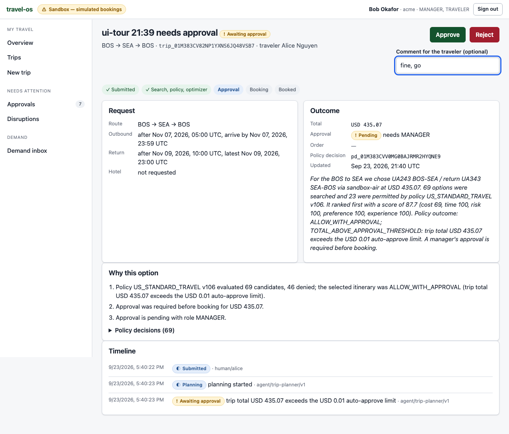

The same trip page with the decision controls: the cost, the policy reasons, the optimizer's ranking, and Approve / Reject with an optional comment for the traveler. A stale decision (the trip moved on) is refused with a conflict, never applied twice.

| Control | What it does |
|---|---|
| Comment for the traveler (optional) | kept with the decision |
| Approve | the workflow continues to booking |
| Reject | the trip ends as Cancelled with the rejection recorded |

### 5.4 Approved, then booked

*Who sees it:* manager

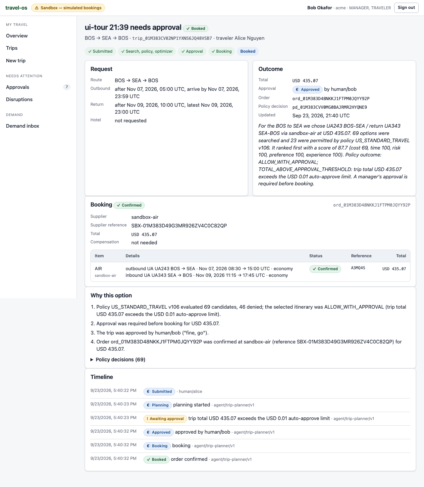

After the decision the page follows the trip: Approved, Booking, Booked, with the approval (who, when, comment) in the outcome and the timeline.

### 5.5 Denied by policy

*Who sees it:* traveler

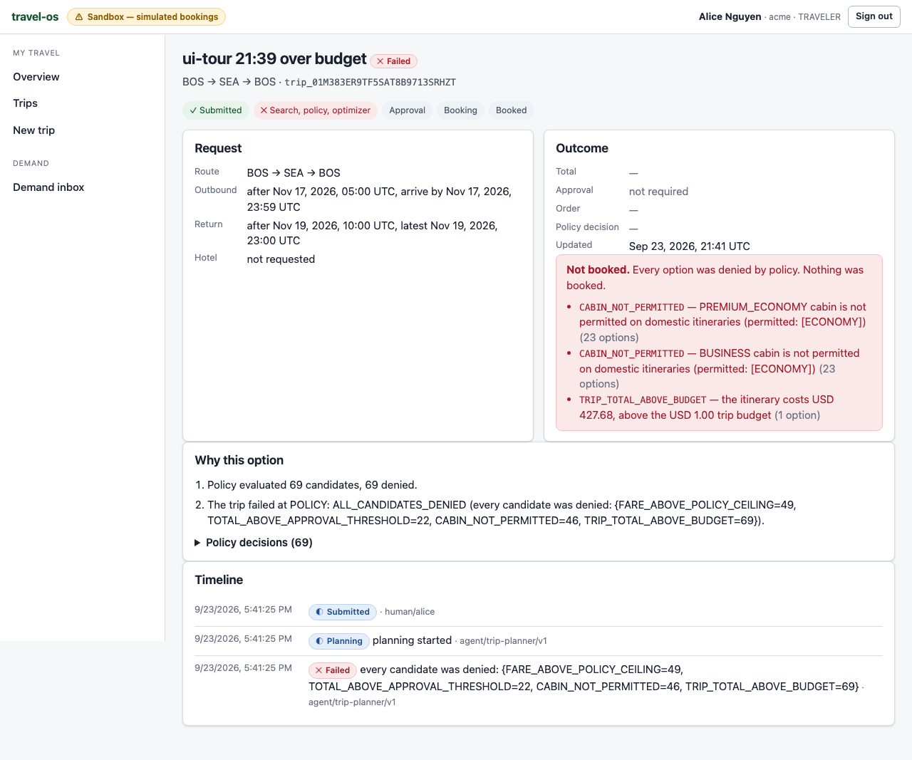

When no candidate is permitted (here a trip budget of USD 1.00 with DENY), the trip ends Failed at the policy step, with the denial reasons policy gave — its own words, per candidate — and nothing booked.

| Control | What it does |
|---|---|
| Not booked | the failure stage and code, and the distinct reasons policy gave, most frequent first |

## 6. Cancelling

A booked trip is never shown as cancelled before the supplier has released it.

### 6.1 Cancel a booked trip

*Who sees it:* traveler, travel admin

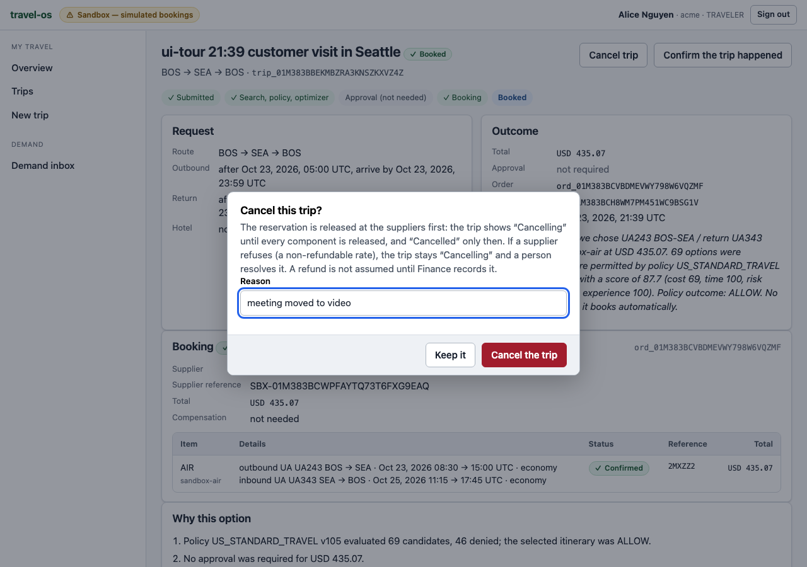

The dialog says what will happen: the reservation is released at the suppliers first, the trip reads Cancelling until every component is released, and Cancelled only then. A refund is not assumed until Finance records it.

| Control | What it does |
|---|---|
| Reason | required; kept in the timeline |
| Cancel the trip | asks the platform to release the reservation |
| Keep it | closes the dialog; focus returns to the button |

### 6.2 Cancelling

*Who sees it:* traveler

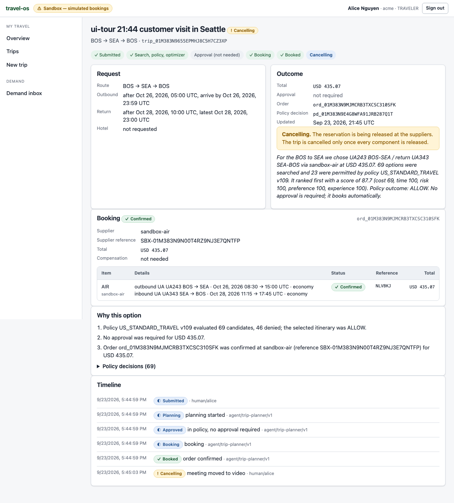

The moment after confirming: the trip is Cancelling and the Order service is releasing the components at the suppliers. The Cancel button is gone (a repeat would change nothing).

| Control | What it does |
|---|---|
| Cancelling | an honest intermediate state; the page keeps polling |

### 6.3 Cancelled

*Who sees it:* traveler

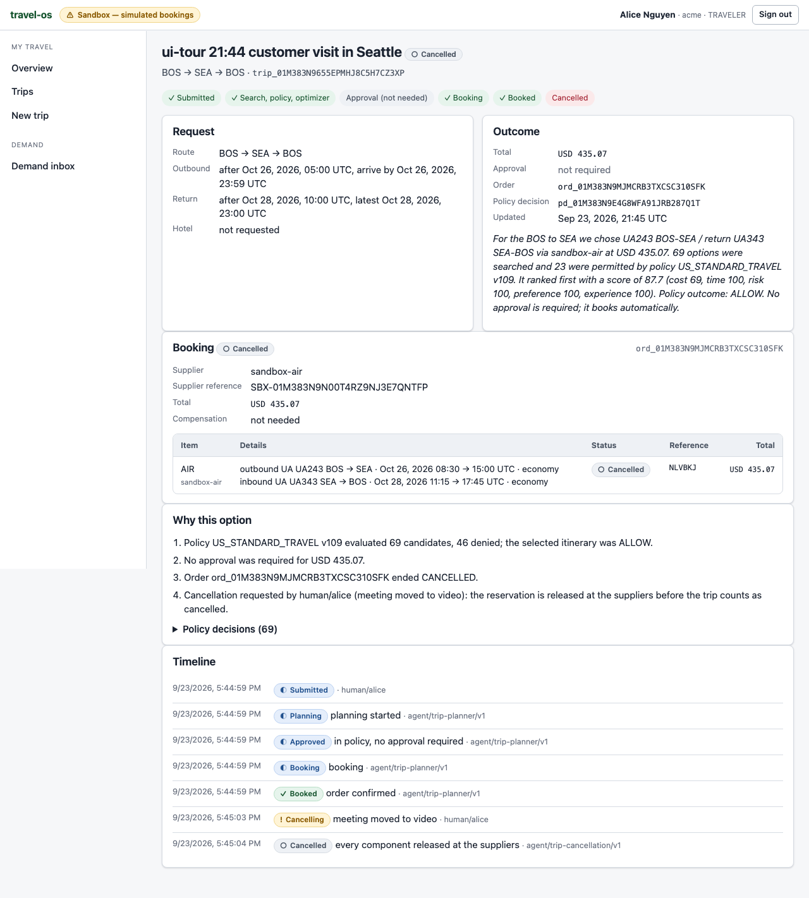

Every component was released: the order is Cancelled, the items are Cancelled, and only now does the trip read Cancelled. The timeline shows the request, the release and the completion, each with its actor.

### 6.4 A supplier refused

*Who sees it:* traveler

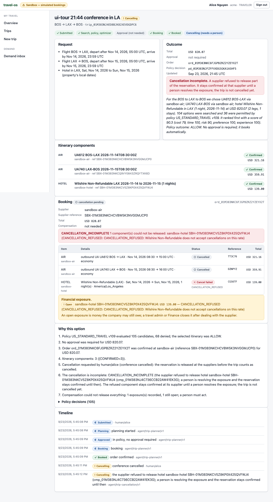

The LAX hotel in the sandbox sells a non-refundable rate that refuses cancellation. The flights are released, the room is not: the trip stays Cancelling (needs a person), the order is cancellation pending with the room marked Cancel failed, and a Financial exposure is recorded. The trip does not claim to be cancelled while the room is still confirmed at the hotel.

| Control | What it does |
|---|---|
| Cancellation incomplete | what was refused and what happens next |
| Financial exposure | the open liability, in the order card, with the supplier's own reason |

### 6.5 Finance: open exposures

*Who sees it:* travel admin, Finance

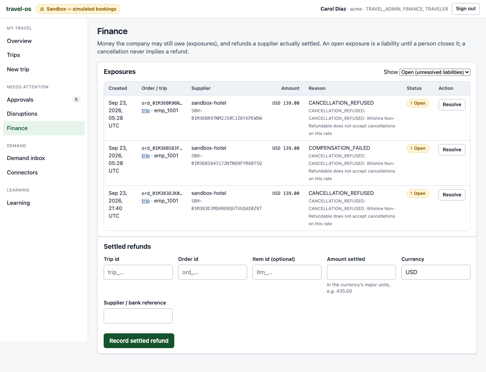

Money the company may still owe, one row per refused release, with the order, trip, supplier, amount and the supplier's reason. A person deals with the supplier (a phone call, a written-off night) and closes the exposure here; the platform completes the cancellation from that.

| Control | What it does |
|---|---|
| Show | open liabilities or resolved ones |
| Resolve | records how it was settled; idempotent, and a second different resolution is refused |
| Settled refunds | Finance records what a supplier actually refunded, in the order's currency; zero is a legitimate settlement, a foreign currency is refused |

### 6.6 Cancelled, once a person released it

*Who sees it:* traveler

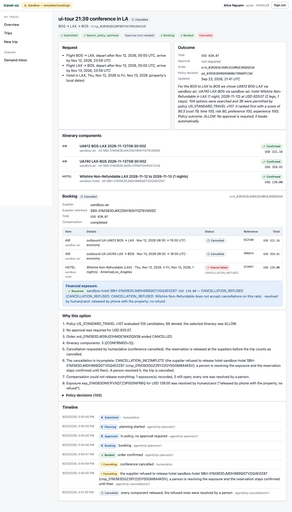

After Finance resolved the exposure the order became Cancelled and the trip followed: Cancelled, with the refusal and the resolution both in the narration and the timeline.

## 7. When the airline cancels

Disruptions are detected from supplier notices and recovered within policy.

### 7.1 A cancelled flight

*Who sees it:* traveler

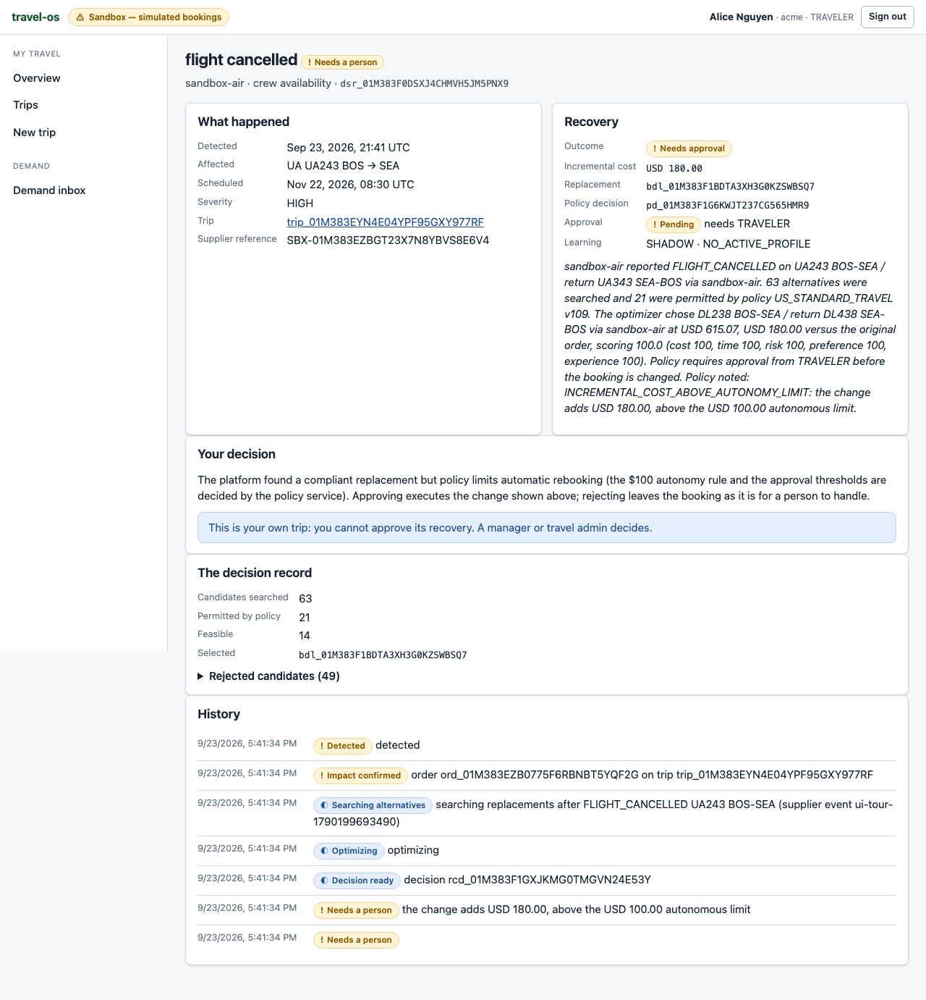

The sandbox airline sent a signed FLIGHT_CANCELLED notice. The platform confirmed the impact on the booked trip, searched alternatives, let policy judge them and picked a replacement. Its incremental cost (USD 180) is above the USD 100 autonomy limit, so a person decides — and the traveler cannot approve a change to their own trip.

| Control | What it does |
|---|---|
| What happened | the notice as received: flight, date, severity, supplier reference |
| Recovery | the replacement, its incremental cost, the policy decision and whose approval it needs |
| The decision record | candidates searched, permitted, feasible, and every rejected one with its reason |

### 7.2 Recoveries in the manager's inbox

*Who sees it:* manager, travel admin

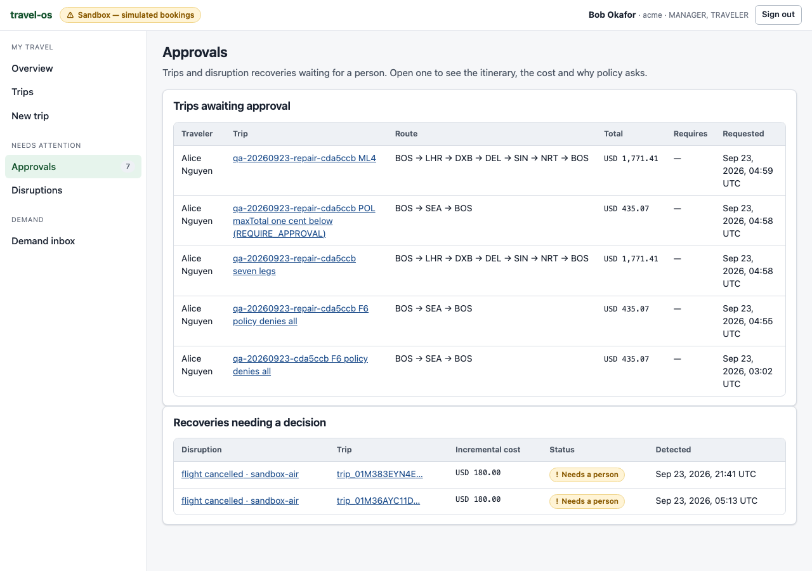

Recovery decisions sit beside trip approvals.

### 7.3 Approving the replacement

*Who sees it:* manager, travel admin

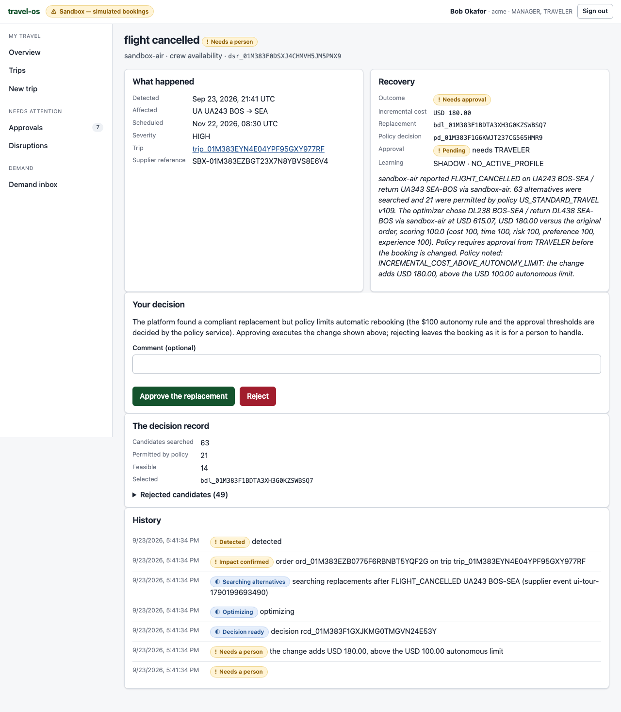

The manager sees the same evidence plus the buttons. Approving executes the change; rejecting leaves the booking as it is for a person to handle by hand.

| Control | What it does |
|---|---|
| Approve the replacement | the Order service changes the booking at the supplier |
| Reject | no change is made |

### 7.4 Resolved

*Who sees it:* everyone involved

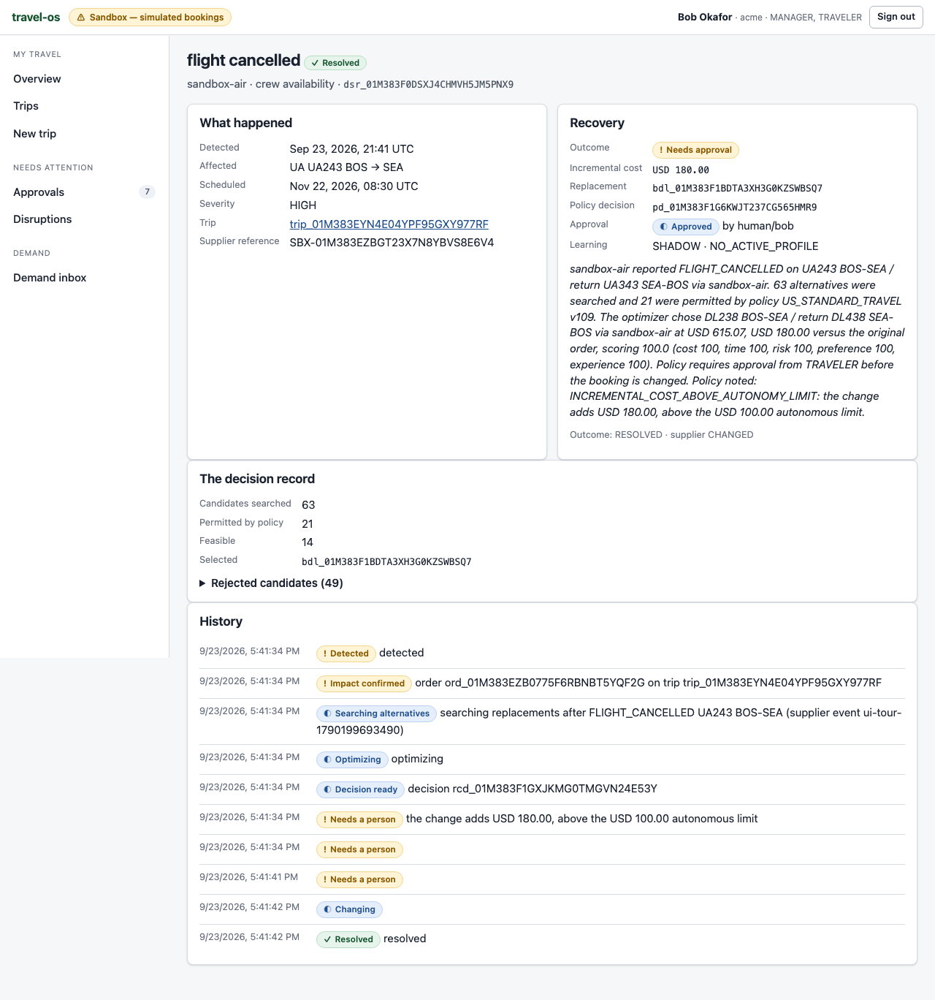

The change went through: the new flights are booked, the old ones replaced, the history shows every step with its timestamp.

### 7.5 The trip after recovery

*Who sees it:* traveler

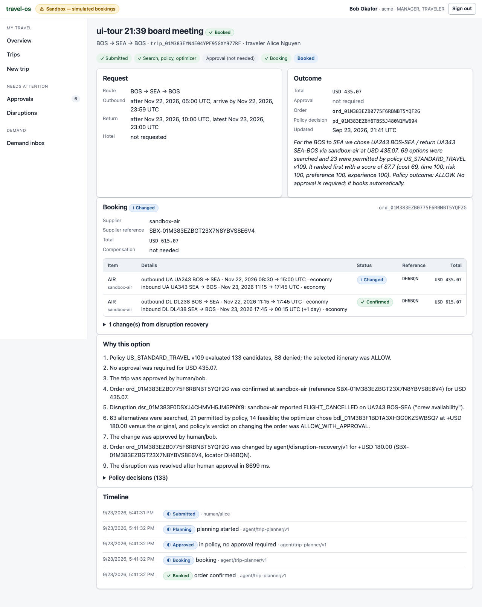

The trip page shows the change with its incremental cost, distinct from the original booking, so the total the company paid is explained line by line.

| Control | What it does |
|---|---|
| change(s) from disruption recovery | what was replaced, retimed or re-dated, and by how much the price moved |

### 7.6 Disruptions

*Who sees it:* travel admin, Finance

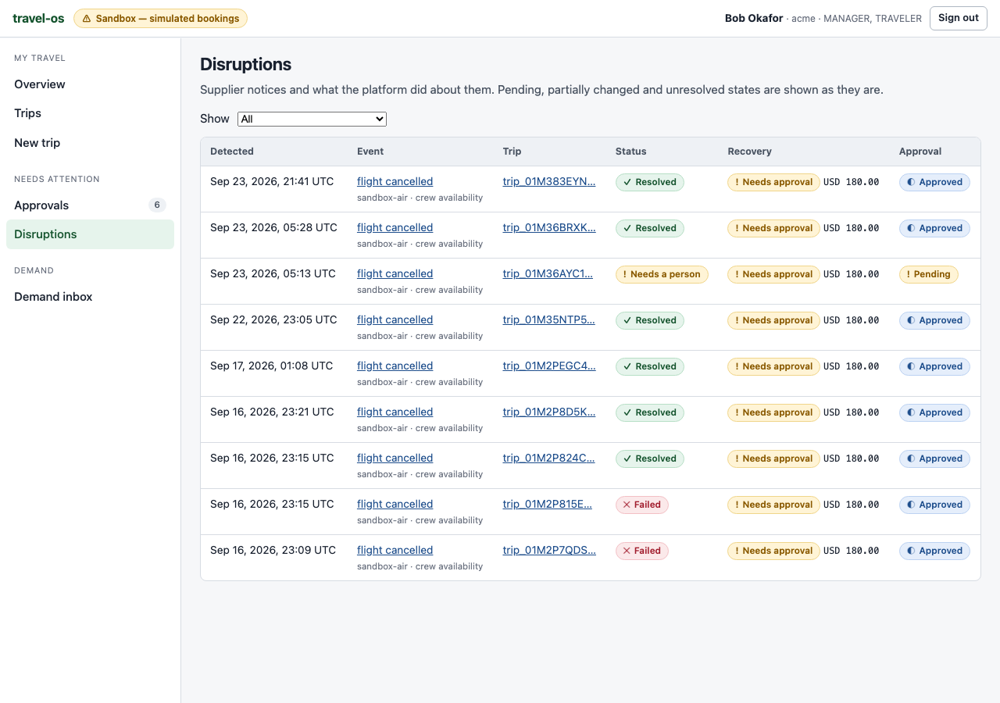

Every disruption of the tenant with its state, for the people who run travel.

## 8. Demand detected from the calendar

The platform notices travel before anyone asks.

### 8.1 Demand inbox

*Who sees it:* traveler

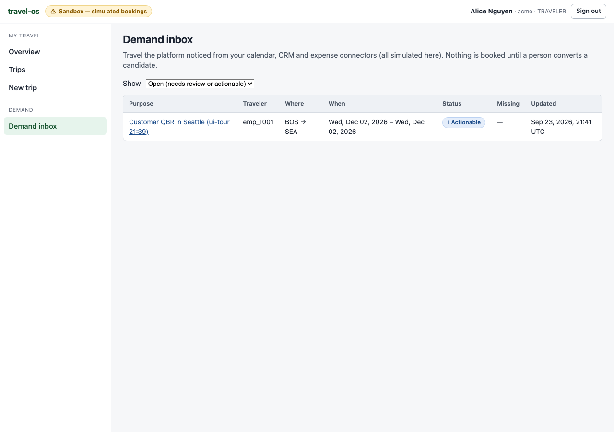

Accepted in-person meetings away from your work location, seen in the (simulated) calendar and cross-checked with HRIS and CRM, become candidates: what, where, when, and why the platform thinks it is travel. Virtual, declined and local events never appear.

| Control | What it does |
|---|---|
| Show | actionable, needs review, dismissed or converted |
| Row link | opens the candidate with its evidence |

### 8.2 A candidate and its evidence

*Who sees it:* traveler

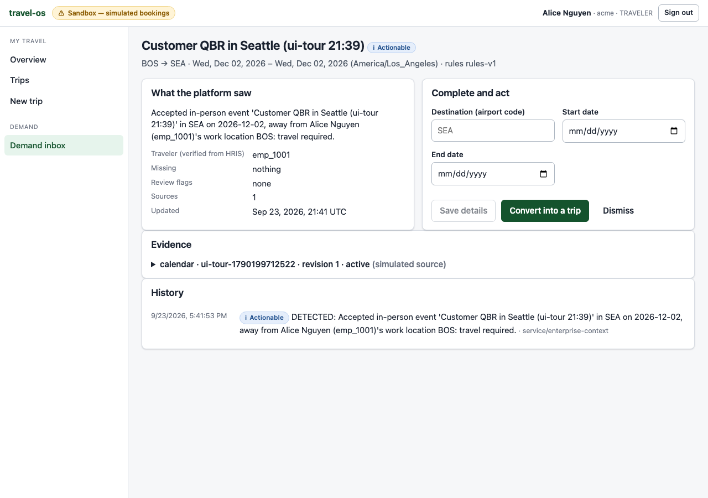

Each source is shown as data — the calendar event, the HRIS identity, the CRM visit — with the rule that fired and what is missing. Injected text in an event title is quoted, never obeyed.

| Control | What it does |
|---|---|
| Convert into a trip | one trip per candidate, however many times it is clicked; the trip records the candidate it came from |
| Dismiss | with a reason; no trip is ever created for it |
| Supply details | when the destination could not be resolved |

### 8.3 The trip it became

*Who sees it:* traveler

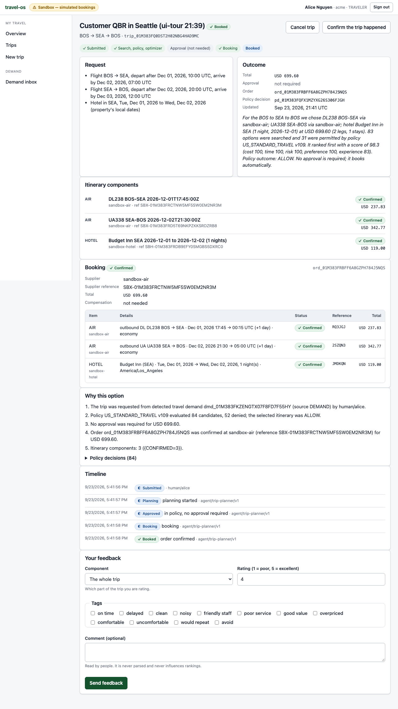

A trip like any other, whose source is DEMAND and whose ledger names the candidate; it goes through the same policy, approval and booking.

### 8.4 Connectors

*Who sees it:* travel admin

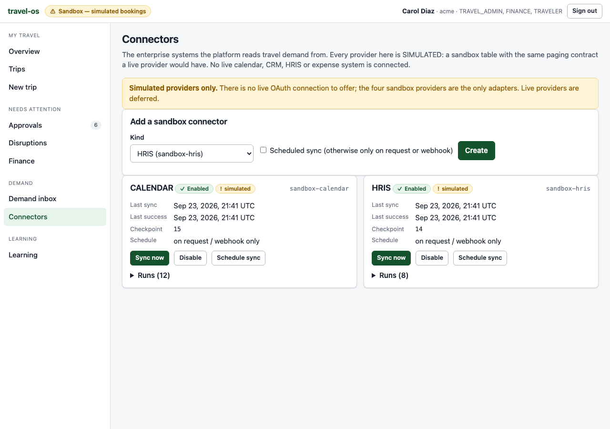

The enterprise sources (calendar, CRM, HRIS, expense), each labelled simulated, with their sync runs, status and configuration.

| Control | What it does |
|---|---|
| Sync now | runs one synchronization and shows its outcome |
| Runs | every run with items seen, candidates created, errors |

## 9. Learning and money

Two admin areas that say exactly what they do.

### 9.1 Learning

*Who sees it:* travel admin

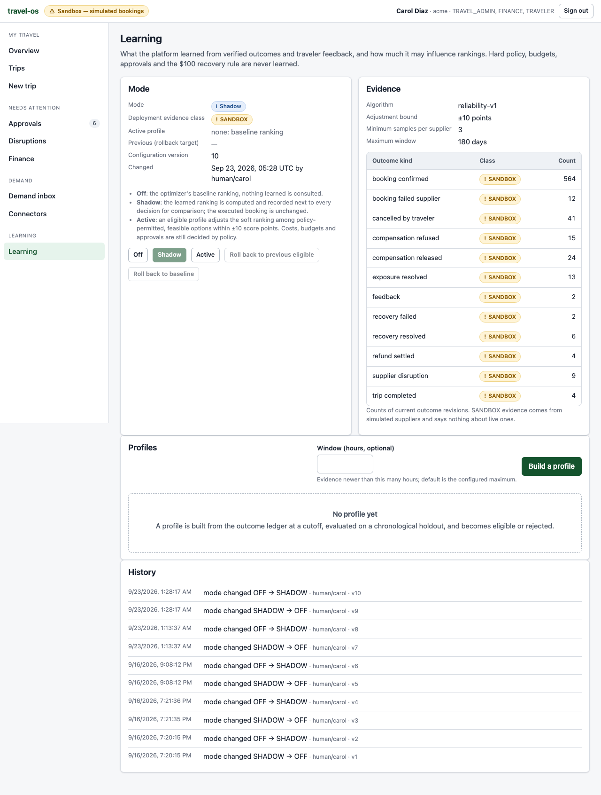

The learned-preference loop: its mode (Off, Shadow, Active), the evidence it was built from, profiles with their bounded adjustments, and honest evaluation wording — in Shadow the learned pick is recorded, not applied. Activation and rollback are versioned; a stale change is refused with a conflict.

| Control | What it does |
|---|---|
| Mode | changing it needs the current version |
| Build / Activate / Roll back | each recorded in the activation history |

### 9.2 Finance

*Who sees it:* travel admin, Finance

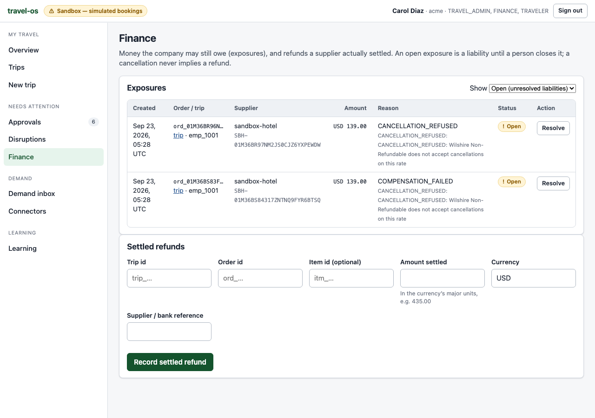

Exposures (above) and settled refunds: Finance records what a supplier actually refunded; a cancellation never implies a refund.

| Control | What it does |
|---|---|
| Record settled refund | trip, order, optional item, amount in the order's currency, and the supplier or bank reference |

## 10. Edges

What the app does when something is not for you, or not there.

### 10.1 Not available for your role

*Who sees it:* traveler at an admin address

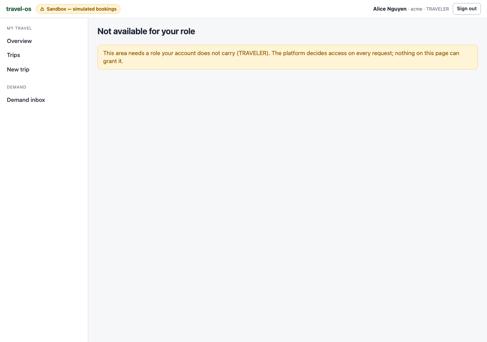

Typing /finance as a traveler shows a plain refusal, and the server would refuse the data anyway.

### 10.2 Not here yet

*Who sees it:* anyone

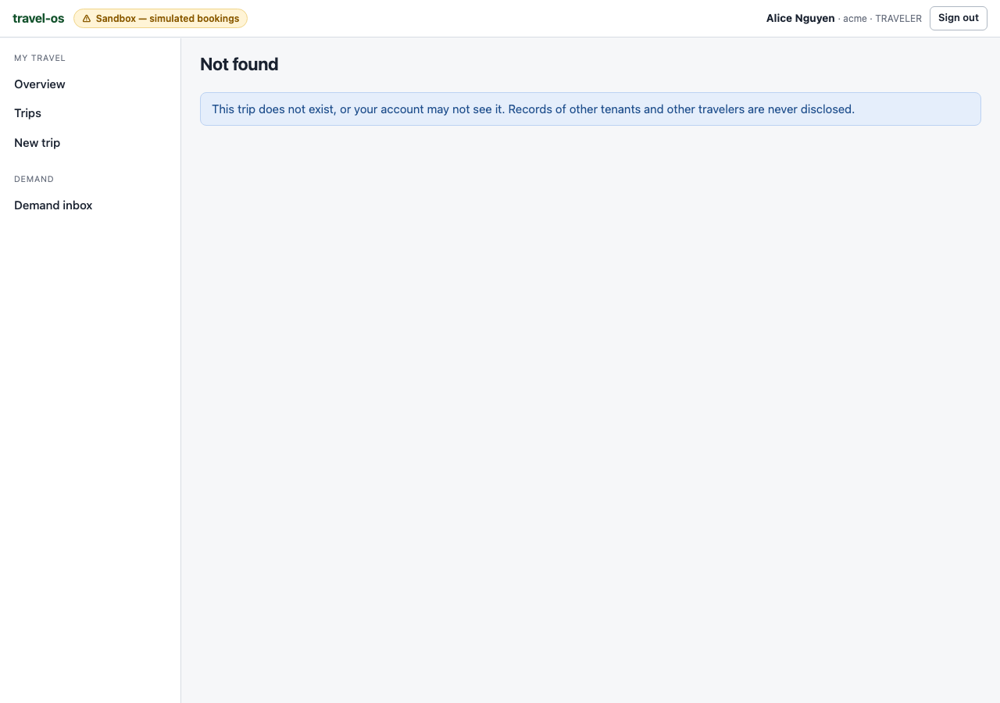

A trip that does not exist — or that belongs to someone else — is not found; existence is never disclosed. The page offers the way back.
